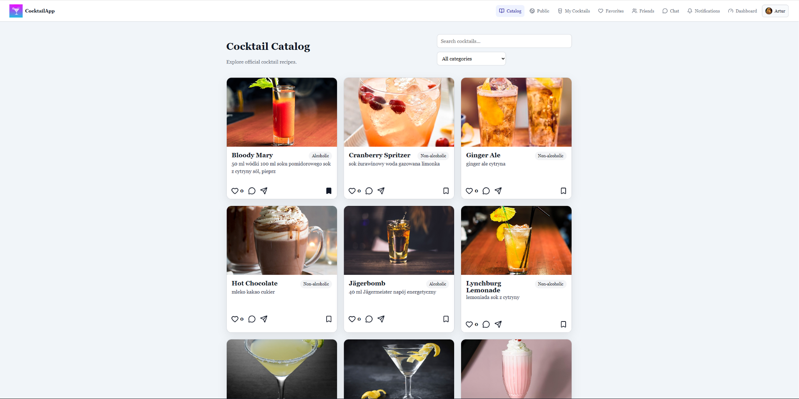
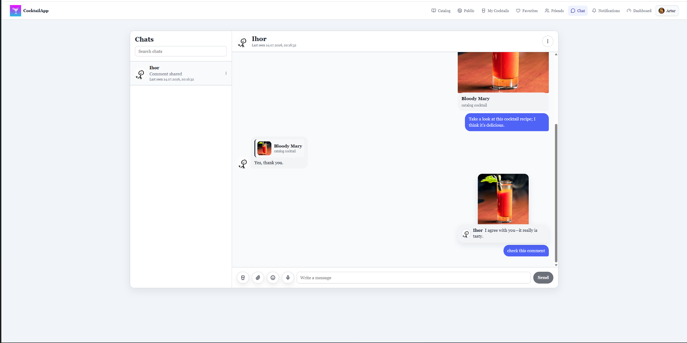
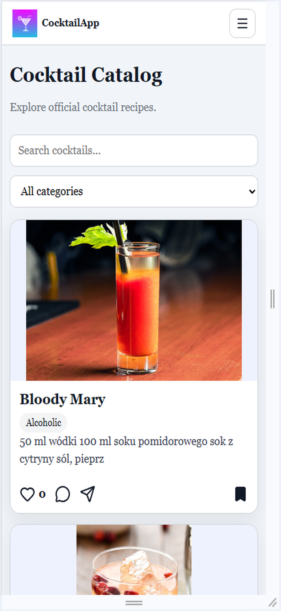
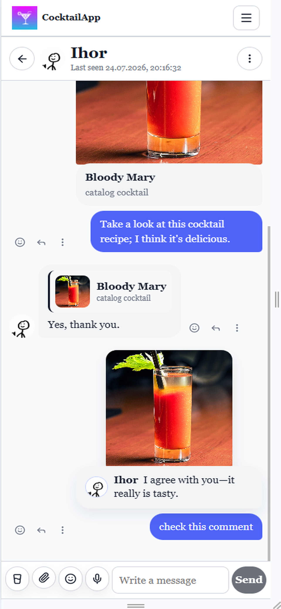

# CocktailApp

CocktailApp to responsywna aplikacja internetowa typu full stack przeznaczona do
wyszukiwania przepisów na koktajle, publikowania własnych receptur oraz
komunikacji z innymi użytkownikami. Aplikacja działa na komputerach i
urządzeniach mobilnych, a także obsługuje tryb Progressive Web App (PWA).

## Najważniejsze funkcje

- rejestracja, logowanie, profile oraz role użytkowników;
- katalog koktajli z wyszukiwaniem i filtrowaniem według kategorii;
- własne koktajle ze stanami wersji roboczej, moderacji i publikacji;
- polubienia, ulubione, komentarze i odpowiedzi;
- znajomi, zaproszenia oraz blokowanie użytkowników;
- prywatny czat czasu rzeczywistego z udostępnianiem koktajli, odpowiedziami i
  załącznikami;
- powiadomienia oraz zgłaszanie treści;
- panel administracyjny do zarządzania użytkownikami, koktajlami, komentarzami
  i zgłoszeniami;
- responsywny interfejs oraz ekran awaryjny PWA działający offline.

## Wykorzystane technologie

- **Frontend:** React, TypeScript, Vite, React Router, Axios i Socket.IO Client
- **Backend:** Node.js, Express, TypeScript, Socket.IO, JWT, bcrypt i Multer
- **Baza danych:** MySQL z biblioteką `mysql2`

## Zrzuty ekranu

### Widok komputerowy

#### Katalog koktajli



#### Czat czasu rzeczywistego



### Widok mobilny

<p align="center">
  
  &nbsp;&nbsp;
  
</p>

## Uruchomienie projektu lokalnie

### Wymagania

- Node.js `^20.19.0` lub `>=22.12.0`
- npm
- MySQL Server

### 1. Sklonowanie repozytorium

```bash
git clone https://github.com/ScandalXD/project.git
cd project
```

### 2. Utworzenie bazy danych

Skrypt SQL tworzy bazę danych `cocktailapp` oraz wszystkie wymagane tabele.

Uruchom klienta MySQL:

```bash
mysql -u root -p
```

Następnie wykonaj:

```sql
SOURCE C:/absolute/path/to/project/server/database/schema.sql;
```

W systemach Linux i macOS użyj ścieżki w formacie:

```sql
SOURCE /absolute/path/to/project/server/database/schema.sql;
```

Zastąp podaną ścieżkę rzeczywistym położeniem sklonowanego projektu.

### 3. Konfiguracja serwera

Utwórz plik `server/.env` na podstawie `server/.env.example`, a następnie ustaw
hasło do MySQL oraz bezpieczny klucz JWT:

```env
DB_HOST=localhost
DB_USER=root
DB_PASSWORD=your_mysql_password
DB_NAME=cocktailapp
DB_PORT=3306

JWT_SECRET=replace_with_a_long_random_secret
```

Backend domyślnie akceptuje klienta uruchomionego pod adresem
`http://localhost:5173`. Kilka dozwolonych adresów frontendu można podać w
`CLIENT_URLS`, rozdzielając je przecinkami, na przykład:

```env
CLIENT_URLS=http://localhost:5173,http://192.168.1.10:5173
```

### 4. Konfiguracja klienta

Utwórz plik `client/.env.local` na podstawie `client/.env.example`:

```env
VITE_API_ORIGIN=http://localhost:3000
```

### 5. Instalacja zależności i uruchomienie backendu

```bash
cd server
npm install
npm run dev
```

API oraz serwer Socket.IO zostaną uruchomione pod adresem
`http://localhost:3000`.

### 6. Uruchomienie frontendu

Otwórz drugi terminal:

```bash
cd client
npm install
npm run dev
```

Otwórz w przeglądarce adres `http://localhost:5173`.

Service worker, instalowanie aplikacji jako PWA oraz funkcje offline są aktywne
dopiero w zbudowanej wersji produkcyjnej. Aby sprawdzić je lokalnie, wykonaj
`npm run build`, a następnie `npm run preview`.

## Opcjonalny dostęp administratora

Nowe konta otrzymują rolę `user`. Aby przetestować panel administracyjny, zmień
rolę wybranego konta w MySQL:

```sql
USE cocktailapp;
UPDATE users SET role = 'superadmin' WHERE email = 'your@email.com';
```

Po zmianie roli zaloguj się ponownie.

## Lokalne sprawdzenie wersji produkcyjnej

```bash
cd server
npm run build
npm start
```

W osobnym terminalu:

```bash
cd client
npm run build
npm run preview
```

Polecenie `npm run preview` służy do lokalnej weryfikacji zbudowanego klienta.
W docelowym środowisku pliki z katalogu `client/dist` należy opublikować na
serwerze przeznaczonym do hostowania aplikacji internetowej.
